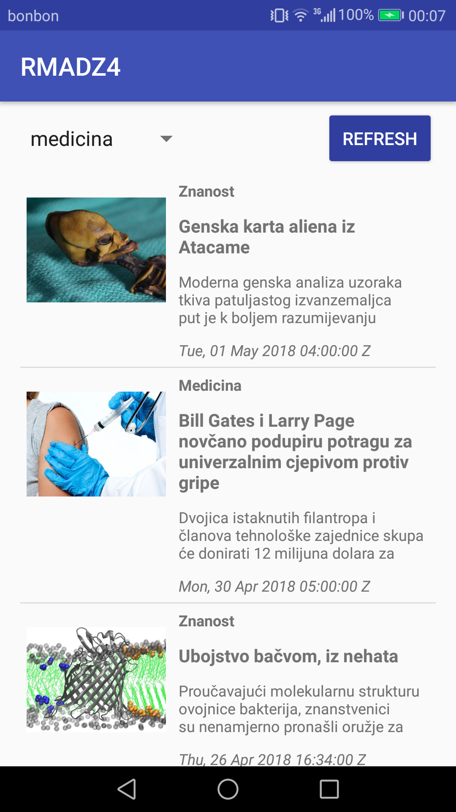

# RMA - DZ4

### The assignment and problems encountered

The assignment was to create an application which shows RSS Feed from web page - [bug.hr](http://www.bug.hr). User can read the title of the RSS, short description anda date. Also, user can filter out the feed by selecting a category from spinner. The application uses *Retrofit* and *SimpleXML* and it shows the feed in a *RecyclerView*.

The main problem was fetching the XML structured data from Bug.hr API and understanding how to do that using **Simple XML** and **Retrofit**.

For easier understanding and implementation, an example from LV was used (omdb api).

### Utilised snippets/solutions/libraries/SO answers

* ButterKnife

```gradle
implementation 'com.jakewharton:butterknife:8.8.1'
annotationProcessor 'com.jakewharton:butterknife-compiler:8.8.1'
```

* Picasso

 ```gradle
implementation 'com.squareup.picasso:picasso:2.71828'
```

* RecyclerView

```gradle
implementation 'com.android.support:recyclerview-v7:26.1.0'
```

* Retrofit

```gradle
implementation 'com.squareup.retrofit2:retrofit:2.4.0'
```

* Simple XML

 ```gradle
implementation ('com.squareup.retrofit2:converter-simplexml:2.4.0') {
        exclude group: 'xpp3', module: 'xpp3'
        exclude group: 'stax', module: 'stax-api'
        exclude group: 'stax', module: 'stax'
    }
```

### Screenshots

<p align="middle">



<br>

